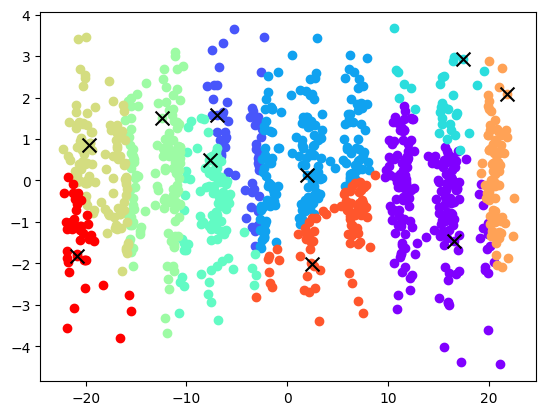
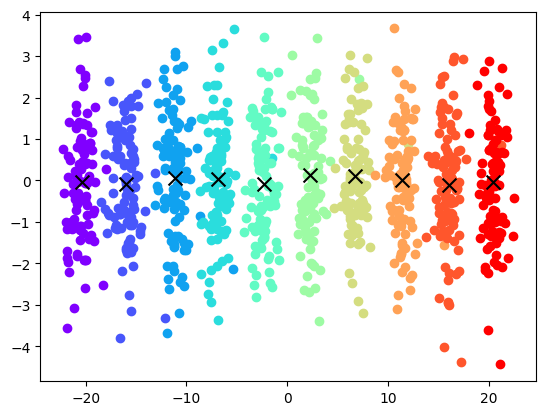

# PCA, K-Means from Scratch, plus a 7-Class LightGBM Classifier

Three-part unsupervised and supervised learning project (PCA via scikit-learn, K-Means implemented by hand, LightGBM classifier).

## Parts
1. **PCA** (scikit-learn) after `StandardScaler` preprocessing, reducing a high-dimensional dataset to 2D.
2. **K-Means** implemented from scratch with NumPy: random centroid initialisation, point-to-centroid assignment, cost function, and the full iterative algorithm (k=10, 1,000 iterations), compared against the dataset's true cluster labels.
3. **Classification** of a 13,611-sample, 16-feature, 7-class dataset: mean imputation, `RobustScaler`, PCA to 10 components, then a **LightGBM** classifier with a stratified 80/20 split.

## Results
| Task | Result |
|---|---|
| K-Means cost after random init (k=10) | 31,457 |
| LightGBM test accuracy (7 classes, 20% held-out) | **92.88%** |

**Limitations.** One random seed and a single train/test split; no hyper-parameter tuning, cross-validation scores or per-class metrics reported for the classifier. The datasets are course-supplied and not included.

## Skills demonstrated
Dimensionality reduction (PCA), K-Means from first principles, feature scaling, gradient-boosted trees (LightGBM), scikit-learn, evaluation on held-out data.

## Run
`pip install -r requirements.txt`, add your own `Dataset1.csv`, `True_clusters_IDs.csv`, `Dataset2.xlsx`, then run the notebook.

## Context
Built as an individual assignment for the MSc in Artificial Intelligence & Machine Learning at the University of Adelaide (Concepts in AI & ML, 2025). Assignment brief text embedded in the notebook is the course's; the implementation and write-up are my own.

## Licence
MIT. See [LICENSE](LICENSE).
